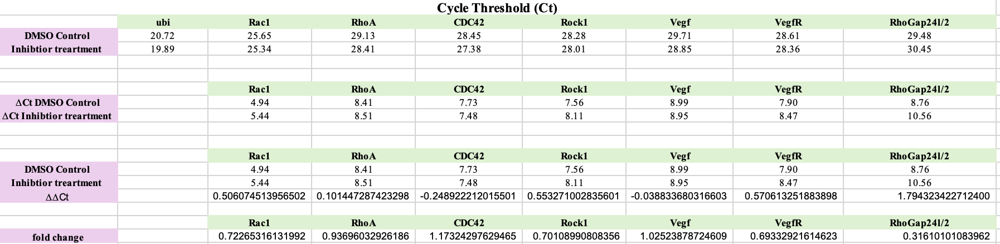
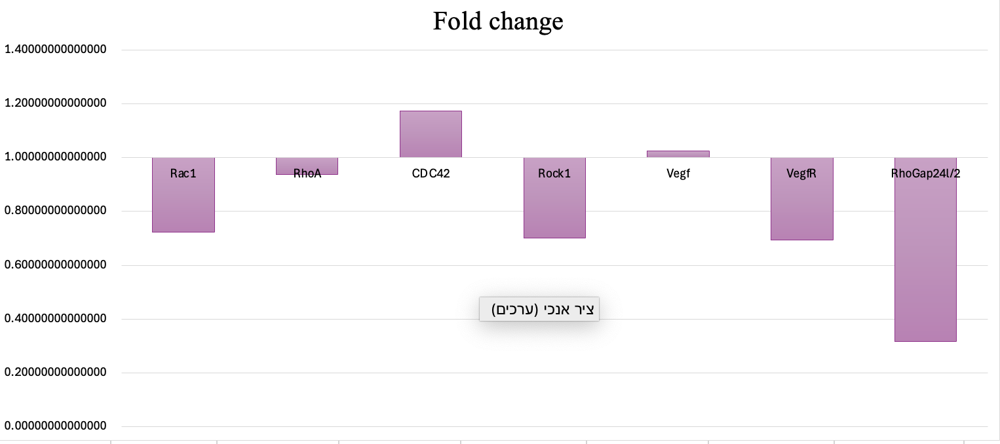

- **Step 1:** Perform qPCR and collect Ct values for target and reference genes.
- **Step 2:** Calculate ΔCt for each sample (ΔCt = Ct(Target) - Ct(Reference)).
- **Step 3:** Calculate ΔΔCt (ΔΔCt = ΔCt(Experimental) - ΔCt(Control)).
- **Step 4:** Calculate relative gene expression using the formula 1.9^(-ΔΔCt).

 